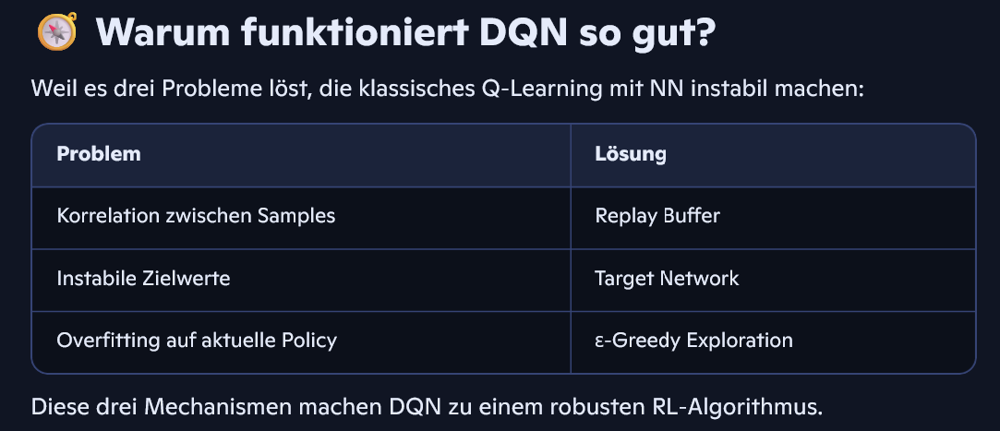

# Q-Learning
1. Grundidee: Q‑Learning mit Funktionsapproximation
Q‑Learning aktualisiert Werte nach:
$$Q(s,a)\leftarrow r+\gamma \max _{a'}Q(s',a')$$
Bei großen oder kontinuierlichen Zustandsräumen ist eine Tabelle unmöglich → ein Neural Network approximiert Q.

2. Das Q‑Netzwerk
Das Netzwerk bekommt den Zustand s als Input und gibt für jede Aktion einen Q‑Wert aus:
- Input: Zustand (z. B. Position, Geschwindigkeit)
- Output: Vektor der Q‑Werte für alle Aktionen
Beispiel CartPole:
Input: 4 Werte → Output: 2 Q‑Werte (left, right)

3. Experience Replay (Replay Buffer)
Statt jede Transition sofort zu lernen, speichert DQN sie in einem Replay Buffer:
$$(s,a,r,s',\mathrm{done})$$
Beim Training werden zufällige Batches gezogen.
Vorteile:
- Bricht Korrelationen zwischen Samples
- Stabilisiert das Lernen
- Erhöht Sample‑Effizienz
Das ist einer der entscheidenden Tricks, warum DQN funktioniert.

4. Target Network
Ein zweites Netzwerk, das langsam aktualisiert wird, liefert stabile Zielwerte:
$$y=r+\gamma \max _{a'}Q_{\mathrm{target}}(s',a')$$
Warum?
- Verhindert, dass das Netz seine eigenen Ziele ständig verschiebt
- Reduziert Divergenz
Das Target‑Netz wird alle N Schritte kopiert oder „soft updated“.

5. Loss‑Funktion
Das Training minimiert den TD‑Error:
$$L=\left( Q_{\mathrm{online}}(s,a)-y\right) ^2$$
Das ist ein klassischer MSE‑Loss.

6. Exploration: ε‑Greedy
Während des Trainings:
- Mit Wahrscheinlichkeit ε → zufällige Aktion
- Mit Wahrscheinlichkeit 1−ε → beste Aktion laut Q‑Netz
ε wird typischerweise über Zeit reduziert (ε‑Decay).

7. Trainingsschleife (kompakt)
Eine Episode läuft so:
- Zustand s beobachten
- Aktion a wählen (ε‑greedy)
- Schritt ausführen → r,s'
- Transition in Replay Buffer speichern
- Mini‑Batch aus Replay Buffer ziehen
- Zielwert y mit Target‑Netz berechnen
- Online‑Netz trainieren
- Target‑Netz periodisch aktualisieren
Das wiederholt sich über viele Episoden.

🧭 Warum funktioniert DQN so gut?
Weil es drei Probleme löst, die klassisches Q‑Learning mit NN instabil machen:

Diese drei Mechanismen machen DQN zu einem robusten RL‑Algorithmus.

🎮 Beispiel: Was macht das Netz eigentlich?
Wenn das Netz lernt, dass „Pole fällt nach rechts“, dann steigt der Q‑Wert für Aktion „left“.
Das Netz lernt also Wertschätzungen, nicht direkt Aktionen.

🧠 Kurzfassung in einem Satz
Ein DQN approximiert die Q‑Funktion mit einem neuronalen Netz, stabilisiert das Lernen durch Replay Buffer und Target‑Netzwerke und wählt Aktionen über ε‑Greedy.

# Verbesserungen

1. Verbesserungen am Q‑Learning‑Update
🔷 Double DQN (DDQN)
- Trennt Aktionswahl und Aktionsbewertung
- Reduziert Overestimation Bias
- Sehr einfache Erweiterung, großer Effekt

🔷 Dueling DQN
- Zerlegt Q(s,a) in:
- V(s) = Wert des Zustands
- A(s,a) = Vorteil der Aktion
- Hilft besonders in Umgebungen, in denen viele Aktionen ähnlich gut sind
- Stabilisiert das Lernen

🔷 Averaged-DQN
- Nutzt mehrere Q‑Netze und mittelt deren Schätzungen
- Reduziert Varianz und Overestimation
- Teurer, aber robuster

🔷 Maxmin DQN
- Mehrere Q‑Netze, aber nimmt das Minimum
- Noch stärkere Kontrolle von Overestimation

🧩 2. Verbesserungen am Replay Buffer
🔶 Prioritized Experience Replay (PER)
- Wählt wichtige Transitionen häufiger
- Beschleunigt Lernen deutlich
- Nutzt TD‑Error als Priorität

🔶 N‑Step Replay
- Nutzt n‑Schritt‑Returns statt 1‑Step
- Bessere Credit Assignment
- Häufig kombiniert mit PER

🔶 Replay Buffer mit Segmentierung / Reservoir Sampling
- Für Non‑stationäre Umgebungen
- Verhindert, dass alte Daten zu dominant werden

🧩 3. Verbesserungen an der Exploration
🔵 Noisy DQN
- Ersetzt ε‑Greedy durch stochastische, lernbare Rauschschichten
- Exploration wird Teil des Modells
- Sehr elegant und oft besser als ε‑Greedy

🔵 Bootstrapped DQN
- Mehrere Q‑Heads, zufällige Maskierung
- Liefert Thompson Sampling‑ähnliche Exploration
- Sehr stark in komplexen Umgebungen

🧩 4. Verbesserungen an der Zielwertschätzung
🟣 Distributional DQN (C51)
- Lernt nicht nur den Erwartungswert Q(s,a), sondern die ganze Verteilung
- Führt zu stabilerem und oft besserem Verhalten
- Grundlage für viele moderne Agenten

🟣 Quantile Regression DQN (QR‑DQN)
- Approximiert die Verteilung über Quantile
- Flexibler als C51
- Grundlage für IQN

🟣 Implicit Quantile Networks (IQN)
- Kontinuierliche Quantile
- Sehr leistungsfähig
- State‑of‑the‑art in vielen Atari‑Benchmarks

🧩 5. Kombinationen der besten Ideen
🟢 Rainbow DQN
Die „All‑Star‑Version“ von DQN.
Kombiniert:
- Double DQN
- Dueling
- Prioritized Replay
- Multi‑Step Learning
- Distributional RL (C51)
- Noisy Nets
- (teilweise) L2‑Regularisierung
Rainbow ist heute der De‑facto‑Standard für DQN‑basierte Agenten.

🧩 6. Erweiterungen für spezielle Szenarien
🟠 Recurrent DQN (DRQN)
- Nutzt LSTM/GRU
- Für POMDPs (teilweise beobachtbare Umgebungen)
- Z. B. bei visuellen RL‑Tasks mit Flickering Frames

🟠 Parametric DQN
- Für Umgebungen mit variablen Aktionsräumen
- Z. B. Empfehlungssysteme, Dialogsysteme

🟠 Multi‑Agent DQN‑Varianten
- VDN, QMIX (nicht direkt DQN, aber Q‑Learning‑basiert)
- Für kooperative Multi‑Agent‑Settings

🧭 Wenn du das Ganze in einer Lernpipeline nutzen willst
Eine sinnvolle Progression wäre:
- DQN
- Double DQN
- Dueling + PER
- Noisy Nets
- Distributional (C51 oder QR‑DQN)
- Rainbow
- Bootstrapped / IQN, je nach Forschungsinteresse
